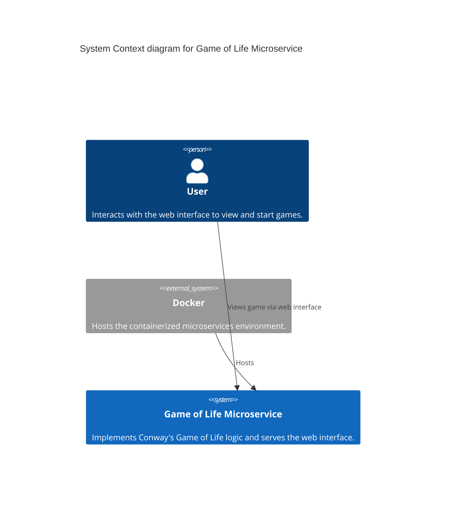
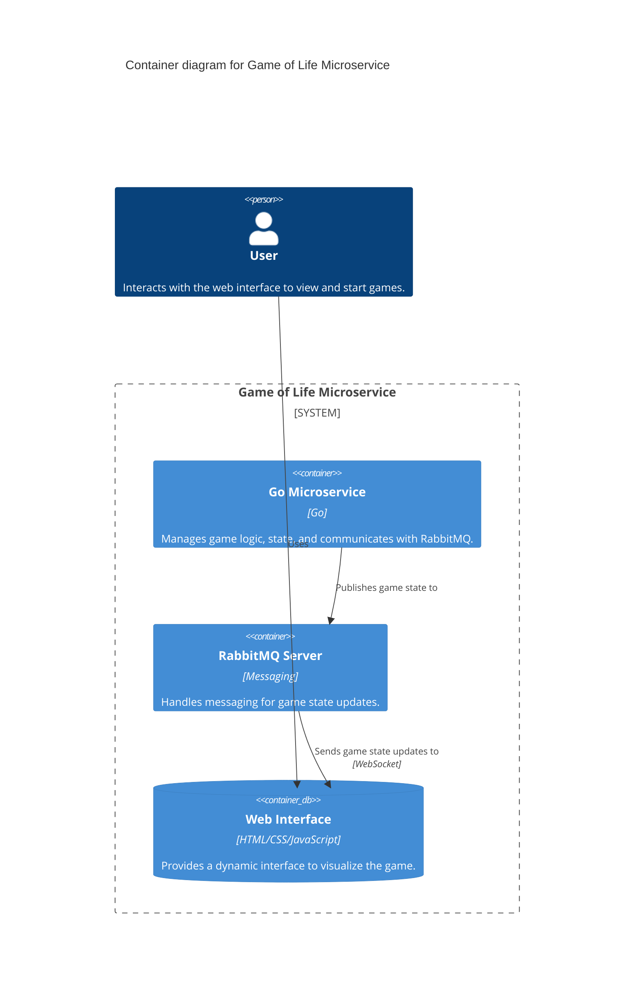
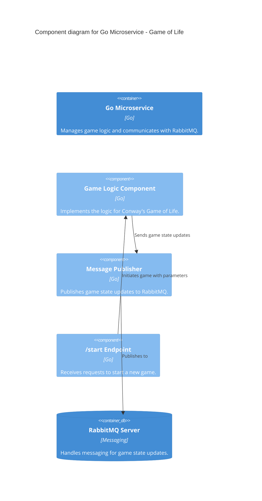

# Game of Life

This project implements Conway's Game of Life as a microservice, utilizing Go for the service logic and RabbitMQ for messaging. It provides a dynamic web interface to visualize the game's progression in real-time.

## Overview

The system comprises a Dockerized environment with two main components:

- **Go Microservice**: Manages the game logic, starting state, board size, and number of ticks. It publishes each game tick to a RabbitMQ topic.
- **RabbitMQ Server**: Acts as a message broker, receiving game states from the Go microservice and making them available to the web interface.

## Features

- Start a new game with a custom initial state, board size, and tick count.
- Real-time visualization of game states for each tick.
- Utilizes bitboards for efficient state management.

## Getting Started

### Prerequisites

- Docker and Docker Compose installed on your machine.

### Installation

1. Clone the repository: `git clone https://github.com/LeahGJoyce/Game-of-Life.git`
1. Navigate into the project directory: `cd Game-of-Life`
1. Build and start the services with Docker Compose: `docker-compose up --build`

### Usage

- Access the web interface at `http://localhost` to view and start games.
- Use the `/start` endpoint to initiate a new game, specifying the starting state, board size, and tick count.

## Architecture

**These diagrams are a work in progress and may not correctly represent the system architecture.**

## C4 System Context Diagram

### C4 Container Diagram

### C4 Component Diagram

## Contributing

Contributions are welcome! Please open an issue or submit a pull request with your suggested changes.

## License

This project is licensed under the MIT License - see the LICENSE file for details.
